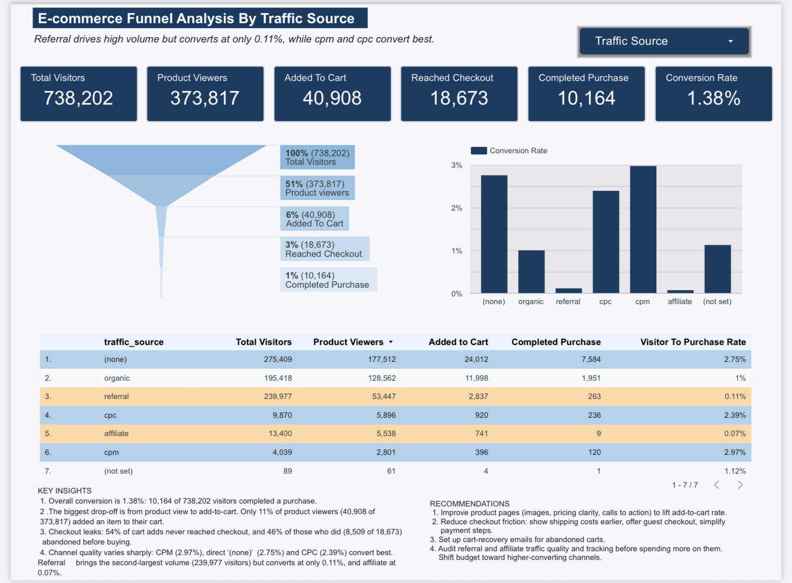

# E-commerce Funnel Analysis Using Traffic Source
An end-to-end funnel analysis of the Google Merchandise Store, built with BigQuery SQL and visualized in a Data Studio (Looker Studio) dashboard. The project shows where visitors drop off on the path to purchase, and how that differs by traffic source.

**Live Dashboard:**  [Click to view dashboard](https://datastudio.google.com/reporting/540d2f1a-407b-4117-83fe-e4be04cf82d4)

## Business Question 
Which traffic sources bring in visitors who actually buy, and at which stage of the funnel do the biggest drop-offs happen?

## Dataset
-  Source:  Google Analytics Sample Dataset (bigquery-public-data.google_analytics_sample.ga_sessions_*)
-  Description: Obfuscated Google Analytics 360 data from the Google Merchandise Store.
-  Grain: One row per session, with nested hits data.

## Funnel Stages

| Stage| Definition |
|-|-|
| Total visitors | Distinct visitors per traffic medium |
| Product viewers | Visitors who viewed a page under /google+redesign/ |
| Added to cart | Visitors with an Add to Cart event |
| Reached checkout | Visitors who reached the checkout step |
| Completed purchase | Visitors with at least one transaction |

The final output also includes a visitor_to_purchase_rate column (completed purchases divided by total visitors).

## Approach
1. Explored the nested GA schema in BigQuery, using UNNEST(hits) to reach event-level data.
2. Built the query with CTEs, one per funnel stage, so each step is readable and easy to debug.
3.	Joined the stages with LEFT JOIN so every traffic source is kept, even if it has no purchases.
4.	Handled edge cases using COALESCE (turn missing counts into 0) and SAFE_DIVIDE (avoid division-by-zero errors).
5. Connected the query to Data Studio and built the dashboard on top of it.

## Tools Used
- Google BigQuery (SQL, CTEs, nested data)
- Data Studio / Looker Studio (dashboard)
- GitHub (documentation)
## Key Findings
  
- Biggest drop-off happens between: product view to add-to-cart.
  
- Best-converting traffic source: CPM at (2.97%) visitor-to-purchase rate.

- Highest-volume traffic source: Referral, but conversion is lower than average.
-  "(none)" represents direct traffic, while "(not set)" represents sessions where Google Analytics did not record a traffic medium.

  
## Recommendation: 
1. Improve product pages (images, pricing clarity, calls to action) to lift add-to-cart rate.
2. Reduce checkout friction: show shipping costs earlier, offer guest checkout, simplify
payment steps.
3. Set up cart-recovery emails for abandoned carts.
4. Audit referral and affiliate traffic quality and tracking before spending more on them.
Shift budget toward higher-converting channels.

## Limitations 
- The sample dataset covers a limited date range (Aug 2016 to Aug 2017) and is anonymized.
- Funnel stages are counted per visitor, not strictly sequentially, so a visitor may appear in a later stage without being counted in an earlier one.

  
